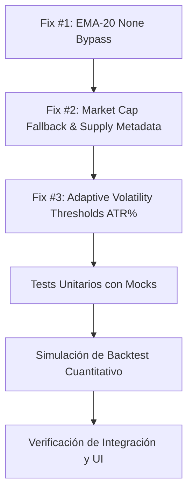

# 📋 PLAN DE REMEDIACIÓN — PASO 2 (P2)
## Crypto Analyzer Pro — Corrección de Bugs Críticos de Trading

**Fecha:** 2026-08-23  
**Versión Objetivo:** v2.2.0  
**Autor:** Quant Developer, Software Engineer & QA Lead  
**Estado:** EN EJECUCIÓN  

---

## 1. Objetivo

Corregir los **3 bugs críticos de trading** identificados en la auditoría cuantitativa del proyecto `crypto-analyzer`, los cuales generan señales erróneas que pueden provocar pérdidas financieras en operaciones reales. Se implementará una arquitectura determinista con tests unitarios 100% aislados de red (mocks), preservando o mejorando el rendimiento histórico del backtest.

---

## 2. Alcance

- **Fix #1 (EMA-20 None Bypass):** Guard clause estricto en Rama 3 (`evaluate_trading_signal`) para evitar falsos "COMPRA LISTA AHORA" cuando `ema20` o `price` son `None` o inválidos.
- **Fix #2 (Market Cap Real en Fallback de Binance):** Enriquecimiento de `COIN_METADATA` con `circulating_supply` y `supply_class`, cálculo preciso de capitalización de mercado en fallback de Binance (evitando distorsión de SHIB y altcoins), y limitador (clamp) de `vol_ratio <= 50.0` en `calculate_momentum_score`.
- **Fix #3 (Umbrales Adaptativos por Volatilidad ATR%):** Modificación del *Falling Knife Guard* en `evaluate_trading_signal` para escalar los umbrales de capitulación 24H y 7D según el porcentaje de volatilidad (`atr_percent`) respecto al benchmark base (5.0% ATR).
- **Suite de Pruebas Unitarias Robustas:** Tests con `pytest` y `unittest.mock` para cubrir todos los nuevos casos de borde, fallbacks y reglas sin llamadas a APIs externas.
- **Validación Cuantitativa de Backtest:** Verificación de no-degradación de métricas (Win Rate, Profit Factor, Max Drawdown, Sharpe).

---

## 3. Fuera de Alcance

- Reestructuración completa de la UI (`app.py` 1600+ líneas) hacia micro-componentes (reservado para Paso 3: Refactorización Arquitectónica).
- Integración de órdenes reales a exchanges (API trading execution).
- Modificación de la estrategia de reversión en soporte "COMPRA EN REBAJA" (Rama 2).

---

## 4. Detalle de Bugs y Criterios de Aceptación

### 🔴 BUG #1: Compra Ciega por Fallo de EMA-20 (`None` Bypass)
- **Ubicación:** `engine.py`, Rama 3 (Impulso Saludable / Entrada Óptima) dentro de `evaluate_trading_signal()`.
- **Causa Raíz:** La condición `if price is not None and ema20 is not None and ema20 > 0 and price < ema20:` evaluaba a `False` cuando `ema20 is None`, cayendo en el `else:` que emitía `BUY` / `COMPRA LISTA AHORA` con `can_buy_now: True`.
- **Impacto:** Apertura de posiciones en momentum sin confirmación de tendencia alcista sobre la media móvil.
- **Criterio de Aceptación:**
  1. Si `ema20 is None` o `price is None` o `ema20 <= 0`:
     - `status: "WAIT"`
     - `badge: "ESPERAR DATOS EMA"`
     - `can_buy_now: False`
     - `risk_level: "Riesgo Medio (Falta Confirmación)"`
     - `plain_explanation: f"Momentum alto ({momentum_score:.1f}) pero datos EMA-20 incompletos. Esperar confirmación."`
  2. Si `price < ema20`:
     - `status: "WAIT"`
     - `badge: "ESPERAR CRUCE EMA"`
     - `can_buy_now: False`
  3. Si `price >= ema20`:
     - `status: "BUY"`
     - `badge: "COMPRA LISTA AHORA"`
     - `can_buy_now: True`

---

### 🔴 BUG #2: Market Cap Distorsionado en Fallback de Binance
- **Ubicación:** `engine.py`, `COIN_METADATA` y `fetch_live_market_data()` (fallback Binance línea 444).
- **Causa Raíz:** Se utilizaba una fórmula fija `p * 460e6` para todas las altcoins. En SHIB ($0.000017), arrojaba un Market Cap de ~$7,800 USD en vez de ~$10B USD. Esto causaba que `vol_ratio` explotara a más de 3,000,000%, saturando el `momentum_score` a 100 y clasificando monedas de bajo volumen como oportunidades óptimas.
- **Impacto:** Falsas señales de momentum máximo generadas por errores aritméticos en fallback.
- **Criterio de Aceptación:**
  1. `COIN_METADATA` incluye `circulating_supply` y `supply_class` para todos los activos registrados.
  2. Fallback de Binance calcula:
     - `mcap_est = price * metadata["circulating_supply"]` si el supply está definido.
     - En caso de activos sin supply explícito, utiliza multiplicador conservador según `supply_class`:
       - `mega`: `price * 19.7e6`
       - `large`: `price * 120e6`
       - `mid`: `price * 500e6`
       - `micro`: `price * 10e6`
  3. `calculate_momentum_score()` implementa clamp de seguridad: `vol_ratio = min(vol_ratio, 50.0)`.

---

### 🔴 BUG #3: Umbrales de Capitulación Estáticos sin Ajuste por Volatilidad (ATR%)
- **Ubicación:** `engine.py`, *Falling Knife Guard* (Rama 2: `RSI <= 36.0`) en `evaluate_trading_signal()`.
- **Causa Raíz:** Umbrales estáticos de `change_24h <= -6.0%` y `change_7d <= -14.0%` aplicados de manera uniforme a BTC (baja volatilidad, ATR% ~3%) y altcoins/meme coins (alta volatilidad, ATR% 8-15%).
- **Impacto:** Falsos positivos en altcoins (bloquea rebotes sanos en soportes) y falsos negativos en BTC (permite comprar desplomes severos).
- **Criterio de Aceptación:**
  1. `evaluate_trading_signal()` recibe parámetro opcional `atr_pct: Optional[float] = None`.
  2. Cálculo del factor de volatilidad:
     $$\text{volatility\_factor} = \max\left(\frac{\max(\text{atr\_pct}, 1.0)}{5.0}, 0.5\right)$$
     Si `atr_pct is None`: $\text{volatility\_factor} = 1.0$.
  3. Umbrales dinámicos:
     - $\text{adjusted\_threshold\_24h} = -6.0 \times \text{volatility\_factor}$
     - $\text{adjusted\_threshold\_7d} = -14.0 \times \text{volatility\_factor}$
  4. La condición de capitulación aplica los umbrales ajustados y genera la explicación dinámica correspondiente con el ATR% actual.

---

## 5. Análisis de Riesgos y Mitigaciones

| Riesgo | Probabilidad | Impacto | Estrategia de Mitigación |
|---|---|---|---|
| Regresión en tests unitarios existentes | Media | Alto | Ejecución de suite completa con `pytest` y actualización fundamentada de casos mock |
| Degradación de métricas de backtest | Media | Alto | Regla estricta: ninguna métrica puede empeorar >5% relativo vs baseline |
| Dependencia de llamadas de red en tests | Alta | Medio | Reemplazo con `unittest.mock` / fixtures locales estáticas |
| Incompatibilidad de firmas de funciones en `app.py` | Baja | Alto | Mantener compatibilidad con valores por defecto `Optional[float] = None` |

---

## 6. Orden de Implementación

1. **Paso 3.1 - Fix #1 (Aislado):** Modificar lógica de Rama 3 en `engine.py`.
2. **Paso 3.2 - Fix #2 (Afecta Score):** Actualizar `COIN_METADATA`, fallback de Binance y clamp en `calculate_momentum_score`.
3. **Paso 3.3 - Fix #3 (Depende de Score y ATR):** Implementar umbrales adaptativos en `engine.py`, conectar `atr_pct` en `app.py` y `backtest.py`.

---

## 7. Estrategia de Rollback

Cada fix es independiente y reversible mediante Git:
- Revertir cambios de código: `git checkout HEAD -- engine.py app.py backtest.py test_engine.py`
- Eliminar reportes generados si se requiere reiniciar: `git clean -f`
