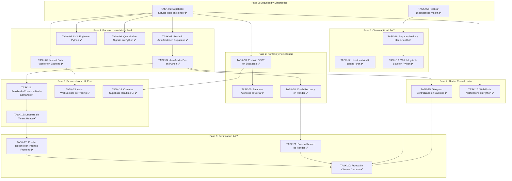

# Crypto Analyzer Pro — 24/7 Cloud Migration
**Plan Maestro de Implementación Técnica y Desacoplamiento Arquitectónico**  
**Versión:** 1.0.0 (Engineering OS v4.1 RC Specification)  
**Estado:** Documento de Planificación — *NO EJECUTAR DIRECTAMENTE*  

---

## 1. Objetivo

Transformar la arquitectura de **Crypto Analyzer Pro** desde su estado actual —donde procesos neurálgicos de trading, escaneo de mercado, cálculo de portafolio y despacho de alertas dependen de que el usuario mantenga abierta una pestaña activa de Chrome en Vercel— hacia una **arquitectura 100% Cloud-First y Autónoma**:

```
Chrome cerrado
↓
Frontend en Vercel cerrado
↓
Usuario desconectado
↓
Crypto Analyzer Pro continúa operando 24/7 en la nube
(Market Data + Grid Bots + DCA + Auto Trader + Señales + Portafolio + Telegram)
```

- **Render:** Ejecutor único, persistente y continuo de todos los workers y motores cuantitativos.
- **Supabase PostgreSQL:** Fuente Única de Verdad (SSOT) para persistencia de estado, historial, sesiones y bus de eventos en tiempo real.
- **Vercel:** Capa de presentación (UI), visualización a 60 FPS y emisión de comandos del operador.

---

## 2. Estado Actual (Diagnóstico Forense)

Durante la auditoría técnica de arquitectura se identificaron fallas estructurales que explican por qué la plataforma deja de operar aproximadamente a los 15 minutos de cerrar el navegador:

1. **Motores de Trading Atrapados en Componentes React (`Context` + `useEffect`)**:
   - `AutoTraderRunner` se ejecuta en el navegador mediante un `setInterval` de 12 segundos en [`AutoTraderContext.tsx`](file:///c:/Users/user/.gemini/antigravity/scratch/crypto-analyzer/frontend/src/contexts/AutoTraderContext.tsx#L1349).
   - Los bots DCA sólo existen en un `setInterval` de 45 segundos en [`BotEngineContext.tsx`](file:///c:/Users/user/.gemini/antigravity/scratch/crypto-analyzer/frontend/src/contexts/BotEngineContext.tsx#L2162-L2198). En el backend no existe código para evaluar DCA.
   - Las señales cuantitativas del Radar (RSI Wilder, rupturas alcistas y soporte dip) y su inserción en la tabla `signals` de Supabase se ejecutan en un `useEffect` del navegador en [`BotEngineContext.tsx`](file:///c:/Users/user/.gemini/antigravity/scratch/crypto-analyzer/frontend/src/contexts/BotEngineContext.tsx#L2380-L2450).
   - El digest periódico de Telegram se envía desde un `setInterval` en [`AutoTraderContext.tsx`](file:///c:/Users/user/.gemini/antigravity/scratch/crypto-analyzer/frontend/src/contexts/AutoTraderContext.tsx#L1401).

2. **Ceguera de Render por Políticas de Row Level Security (RLS)**:
   - Render opera con `SUPABASE_KEY` (rol `anon`).
   - La política de RLS en `auto_trader_sessions` exige `(auth.uid() = user_id OR user_id IS NULL)`.
   - Cuando Render consulta con la clave anónima, `auth.uid()` es `NULL`. Para cualquier sesión de un usuario registrado, Supabase devuelve `[]`.
   - Render reporta en su `/health`: `"active_sessions_count": 0`. El motor en la nube nunca toma el control de las sesiones.
   - De igual forma, `user_profiles` exige `auth.uid() = id`, por lo que el método `credit_user_balance` en [`supabase_client.py`](file:///c:/Users/user/.gemini/antigravity/scratch/crypto-analyzer/supabase_client.py#L669) falla silenciosamente sin poder acreditar el saldo demo.

3. **Falso SSOT en `localStorage`**:
   - Tenencias spot (`crypto_analyzer_demo_holdings`), saldos, estados de sesión y cooldowns de Telegram residen en el navegador ([`PortfolioContext.tsx`](file:///c:/Users/user/.gemini/antigravity/scratch/crypto-analyzer/frontend/src/contexts/PortfolioContext.tsx#L47-L109)).
   - Al cerrar Chrome, el portafolio queda inerte y no se recalcula.

4. **Desconexión Total de WebSockets**:
   - Los WebSockets de Binance residen exclusivamente en el cliente ([`MarketDataContext.tsx`](file:///c:/Users/user/.gemini/antigravity/scratch/crypto-analyzer/frontend/src/contexts/MarketDataContext.tsx#L246) y [`autoTraderRunner.ts`](file:///c:/Users/user/.gemini/antigravity/scratch/crypto-analyzer/frontend/src/lib/autoTraderRunner.ts#L1999)). Al cerrar la pestaña, se destruyen.
   - En el backend no hay WebSockets; sólo un polling REST cada 15 segundos con bloqueo de IP geográfica de Binance Global en Oregon (forzando fallback a Binance US y Bybit).

5. **Bug de Diagnóstico en el Health Check**:
   - En [`telegram_bot.py`](file:///c:/Users/user/.gemini/antigravity/scratch/crypto-analyzer/telegram_bot.py#L1411-L1416), la variable `_WORKER_DIAGNOSTICS` nunca actualiza `open_trades_count` ni `active_sessions_count`, reportando `0` perpetuamente.
   - Existen **648 operaciones abiertas en `bot_trades`** (459 pertenecientes a un único bot de TRX), las cuales no son gestionadas adecuadamente porque su `entry_reason` es texto plano en vez de JSON con parámetros `tp`/`sl`.

6. **Caché de Mercado Congelada**:
   - La tabla `market_data_cache` en Supabase no ha sido actualizada desde el **23 de Agosto de 2026**. Ningún proceso cloud escribe en ella.

---

## 3. Arquitectura Objetivo

```
┌─────────────────────────────────────────────────────────────────────────────┐
│                          EXTERNAL EXCHANGES & APIS                          │
│         Binance Global / Binance US / Bybit Spot (REST & WebSockets)        │
└──────────────────────────────────────┬──────────────────────────────────────┘
                                       │ Precios en vivo (Ticks & Klines)
                                       ▼
┌─────────────────────────────────────────────────────────────────────────────┐
│                         RENDER CLOUD 24/7 WORKER                            │
│  ┌───────────────────────────────────────────────────────────────────────┐  │
│  │ 1. Market Data Daemon (Polling tolerante a IP + Sincronización DB)    │  │
│  │ 2. Grid Engine Daemon (Mallas activas, Stop Loss y Take Profit)       │  │
│  │ 3. DCA Engine Daemon (Compras periódicas escalonadas y anti-caída)   │  │
│  │ 4. Auto Trader Pro Engine (Escaneo multimoneda, Break-Even, Trailing) │  │
│  │ 5. Quantitative Signal Daemon (RSI, Breakout, ATR, Soporte)           │  │
│  │ 6. Observability & Deep Health (Pings de Supabase pg_cron + Uptime)   │  │
│  │ 7. Despachador de Alertas Centralizado (Telegram Bot API + WebPush)   │  │
│  └───────────────────────────────────────────────────────────────────────┘  │
└──────────────────────────────────────▲──────────────────────────────────────┘
                                       │ Lectura / Escritura privilegiada
                                       │ (SUPABASE_SERVICE_ROLE_KEY)
                                       ▼
┌─────────────────────────────────────────────────────────────────────────────┐
│                       SUPABASE POSTGRESQL 17 (SSOT)                         │
│  • auto_trader_sessions (Estado persistente de la sesión 24/7)              │
│  • bots & bot_trades (Configuración de mallas, DCA e historial de órdenes)  │
│  • user_profiles & user_portfolios (Libro contable y custodia virtual)     │
│  • signals (Registro histórico de señales cuantitativas)                    │
│  • market_data_cache (Última cotización y volumen persistido)               │
│  • pg_cron + pg_net (Keep-alive cada 5 min hacia /deep-health de Render)    │
│  • Supabase Realtime (Emisión de postgres_changes a clientes conectados)    │
└──────────────────────────────────────┬──────────────────────────────────────┘
                                       │ Eventos WebSocket Realtime
                                       ▼
┌─────────────────────────────────────────────────────────────────────────────┐
│                       VERCEL FRONTEND (REACT 19 + PWA)                      │
│  • Visualización a 60 FPS (TradingView Lightweight Charts v5)               │
│  • Emisión de comandos de usuario (Iniciar / Detener / Ajustar Parámetros)  │
│  • CERO timers de ejecución de trading (Sin setInterval de trading)         │
│  • CERO dependencia de que la pestaña permanezca abierta                    │
└─────────────────────────────────────────────────────────────────────────────┘
```

---

## 4. Principios Arquitectónicos

1. **Backend = Ejecución Persistente Exclusiva**:
   Ningún cálculo que determine compra, venta, stop loss, take profit o rescate de capital debe depender del renderizado de un componente React.
2. **Supabase = Persistencia y SSOT**:
   Ninguna métrica operativa o financiera debe residir únicamente en `localStorage`. Si un dato importa para el negocio, debe estar en PostgreSQL.
3. **Frontend = UI + Comandos (Presentation & Command Layer)**:
   El frontend solo envía intenciones (ej. `PATCH status = 'SCANNING'`) y renderiza el estado que la base de datos le notifica vía Realtime.
4. **Render = Worker Cloud Autónomo**:
   El backend debe iniciarse, autenticarse con permisos de servicio, leer la base de datos, reconectar datos de mercado y continuar operando sin requerir que ningún cliente HTTP se conecte.
5. **Binance / Bybit = Market Data con Tolerancia Geográfica**:
   El sistema no debe colapsar por bloqueos de IP en centros de datos de EE.UU. Debe contar con una cascada de fallback determinista (Bybit Spot -> Binance US -> CoinGecko).
6. **Telegram = Despacho Centralizado en Servidor**:
   El token de Telegram jamás debe residir en el código del cliente. Todas las alertas deben ser emitidas desde el backend.
7. **Idempotencia y Resiliencia**:
   El reinicio del contenedor en Render no debe generar órdenes duplicadas ni alterar balances erróneamente.

---

## 5. Plan Detallado de Tasks (Por Fases)

---

### FASE 0 — SEGURIDAD Y PREPARACIÓN

#### TASK-01: Auditar y preparar acceso seguro del backend a Supabase (Service Role) [COMPLETADA ✅]
- **ID:** `TASK-01`
- **Contrato:** [`contracts/TSK-CLOUD-004.contract.json`](file:///c:/Users/user/.gemini/antigravity/scratch/crypto-analyzer/contracts/TSK-CLOUD-004.contract.json)
- **Estado:** ✅ APROBADO (Tests: `test_supabase_service_role.py`)
- **Nombre:** Configuración de `SUPABASE_SERVICE_ROLE_KEY` en Render y actualización de cliente PostgREST
- **Objetivo:** Permitir que el worker en Render lea y escriba en `auto_trader_sessions`, `user_profiles` y `push_subscriptions` sin ser bloqueado por las políticas de Row Level Security (RLS).
- **Problema que resuelve:** Actualmente Render usa `SUPABASE_KEY` con rol `anon`. Debido a RLS, `sb.get_active_auto_trader_sessions()` devuelve `[]` y `sb.credit_user_balance()` falla silenciosamente, dejando al backend completamente ciego e incapacitado para operar cuentas de usuario.
- **Archivos afectados:**
  - [`supabase_client.py`](file:///c:/Users/user/.gemini/antigravity/scratch/crypto-analyzer/supabase_client.py) (`_get_headers`, `__init__`)
  - [`render.yaml`](file:///c:/Users/user/.gemini/antigravity/scratch/crypto-analyzer/render.yaml) (`envVars`)
- **Tablas afectadas:** `auto_trader_sessions`, `user_profiles`, `user_portfolios`, `push_subscriptions`
- **Cambios previstos:**
  1. Configurar `SUPABASE_SERVICE_ROLE_KEY` en el dashboard de Render como Environment Secret.
  2. Modificar `supabase_client.py` para priorizar `SUPABASE_SERVICE_ROLE_KEY` sobre `SUPABASE_KEY`.
  3. Asegurar que bajo ninguna circunstancia dicha clave se agregue al frontend de Vite (`VITE_*`) ni se exponga al cliente.
  4. Mantener RLS estricto en Supabase para clientes anónimos y autenticados vía frontend.
- **Dependencias:** Ninguna (Primera tarea obligatoria).
- **Riesgos:** Si la clave service_role se filtrase al frontend, cualquier usuario podría leer toda la base de datos. Se debe auditar con git grep que nunca entre a `frontend/`.
- **Tests necesarios:** Script de prueba backend que consulte `get_active_auto_trader_sessions()` y verifique lectura exitosa de sesiones con `user_id` no nulo.
- **Criterios de aceptación:**
  - Render consulta `auto_trader_sessions` y recibe las sesiones activas reales de usuarios.
  - La clave NO está presente en el repositorio ni en bundles de Vite.
- **Rollback / Precauciones:** Volver a usar `SUPABASE_KEY` estándar en caso de discrepancia.

---

#### TASK-02: Corregir y validar el sistema de health diagnostics [COMPLETADA ✅]
- **ID:** `TASK-02`
- **Contrato:** [`contracts/TSK-CLOUD-005.contract.json`](file:///c:/Users/user/.gemini/antigravity/scratch/crypto-analyzer/contracts/TSK-CLOUD-005.contract.json)
- **Estado:** ✅ APROBADO (Tests: `test_health_diagnostics.py`)
- **Nombre:** Reparación de métricas en `_WORKER_DIAGNOSTICS` y endpoint `/health`
- **Objetivo:** Proporcionar visibilidad real sobre el estado del worker en segundo plano, número real de sesiones, trades abiertos y tiempos de tick.
- **Problema que resuelve:** En [`telegram_bot.py:L1411-L1416`](file:///c:/Users/user/.gemini/antigravity/scratch/crypto-analyzer/telegram_bot.py#L1411-L1416), la variable global `_WORKER_DIAGNOSTICS` omite actualizar `open_trades_count` y `active_sessions_count`, reportando falsamente `0` en cada consulta HTTP.
- **Archivos afectados:**
  - [`telegram_bot.py`](file:///c:/Users/user/.gemini/antigravity/scratch/crypto-analyzer/telegram_bot.py) (`execute_market_evaluation_cycle`, `HealthHTTPRequestHandler`)
- **Tablas afectadas:** Ninguna.
- **Cambios previstos:**
  1. En `execute_market_evaluation_cycle`, asignar:
     ```python
     _WORKER_DIAGNOSTICS["open_trades_count"] = len(open_trades)
     _WORKER_DIAGNOSTICS["active_sessions_count"] = len(active_sessions)
     _WORKER_DIAGNOSTICS["last_market_update_iso"] = datetime.now(timezone.utc).isoformat()
     ```
  2. Diferenciar en la respuesta JSON entre: `http_server: "alive"`, `worker_thread: "active"`, `last_tick_age_seconds: X`.
- **Dependencias:** Ninguna.
- **Riesgos:** Ninguno. Es puramente observabilidad interna.
- **Tests necesarios:** Consulta `curl https://crypto-analyzer-bot-p1ri.onrender.com/health` verificando que los campos muestren valores enteros reales distintos de cero cuando correspondan.
- **Criterios de aceptación:**
  - El endpoint `/health` muestra el número real de sesiones y operaciones abiertas sin congelarse en 0.
- **Rollback / Precauciones:** Restaurar el diccionario de diagnóstico previo.

---

### FASE 1 — BACKEND COMO MOTOR REAL

#### TASK-03: Migrar estado crítico del Auto Trader desde `localStorage` hacia Supabase [COMPLETADA ✅]
- **ID:** `TASK-03`
- **Contrato:** [`contracts/TSK-CLOUD-006.contract.json`](file:///c:/Users/user/.gemini/antigravity/scratch/crypto-analyzer/contracts/TSK-CLOUD-006.contract.json)
- **Estado:** ✅ APROBADO (Tests: `test_cloud_auto_trader.py`)
- **Nombre:** Persistencia completa del estado de sesión de Auto Trader en Supabase
- **Objetivo:** Garantizar que la posición activa, niveles dinámicos y métricas no dependan del almacenamiento local del navegador.
- **Problema que resuelve:** [`AutoTraderContext.tsx:L987-L997`](file:///c:/Users/user/.gemini/antigravity/scratch/crypto-analyzer/frontend/src/contexts/AutoTraderContext.tsx#L987-L997) guarda `autotrader_active_position` y `autotrader_is_running` en `localStorage`. Si el usuario cierra Chrome o cambia de dispositivo, la sesión se pierde o se bifurca.
- **Archivos afectados:**
  - [`supabase_client.py`](file:///c:/Users/user/.gemini/antigravity/scratch/crypto-analyzer/supabase_client.py) (`upsert_auto_trader_session`, `update_auto_trader_session`)
  - [`frontend/src/lib/supabase.ts`](file:///c:/Users/user/.gemini/antigravity/scratch/crypto-analyzer/frontend/src/lib/supabase.ts)
  - [`frontend/src/contexts/AutoTraderContext.tsx`](file:///c:/Users/user/.gemini/antigravity/scratch/crypto-analyzer/frontend/src/contexts/AutoTraderContext.tsx)
- **Tablas afectadas:** `auto_trader_sessions`
- **Cambios previstos:**
  1. Asegurar que `auto_trader_sessions.active_position` contenga el payload canónico completo:
     `{ symbol, coin_id, entry_price, units, amount_usd, highest_price, stop_loss, take_profit, be_armed, trailing_armed, entry_time }`.
  2. Sincronizar inmediatamente cualquier cambio de estado a la base de datos.
- **Dependencias:** `TASK-01`.
- **Riesgos:** Conflictos de sobrescritura concurrente si el frontend y el backend intentan modificar la fila al mismo tiempo. Se debe designar a Render como escritor exclusivo cuando la sesión esté activa.
- **Tests necesarios:** Iniciar sesión, cerrar navegador, consultar Supabase vía REST y comprobar que el JSON de `active_position` y `status` permanezcan intactos.
- **Criterios de aceptación:**
  - Cerrar la ventana del navegador no borra ni resetea la sesión en Supabase.
- **Rollback / Precauciones:** Mantener fallback de lectura de `localStorage` mientras se valida la persistencia cloud.

---

#### TASK-04: Convertir Render en el ejecutor único del Auto Trader Pro [COMPLETADA ✅]
- **ID:** `TASK-04`
- **Contrato:** [`contracts/TSK-CLOUD-006.contract.json`](file:///c:/Users/user/.gemini/antigravity/scratch/crypto-analyzer/contracts/TSK-CLOUD-006.contract.json)
- **Estado:** ✅ APROBADO (Tests: `test_cloud_auto_trader.py`)
- **Nombre:** Implementación completa del ciclo autónomo del Auto Trader en Python
- **Objetivo:** Que el bucle en [`telegram_bot.py:run_cloud_auto_trader_cycle`](file:///c:/Users/user/.gemini/antigravity/scratch/crypto-analyzer/telegram_bot.py#L819) ejecute todo el ciclo: escaneo, selección de candidato, entrada simulada, control de Break-Even (+0.8%), Trailing Stop, Take Profit (+2.0%), Stop Loss (-2.0%) y rescate de capital a USDT.
- **Problema que resuelve:** Actualmente la lógica principal de trading se ejecuta en TypeScript mediante `autoTraderRunner.ts` en el navegador del usuario. Al cerrar Chrome, el trading se detiene.
- **Archivos afectados:**
  - [`telegram_bot.py`](file:///c:/Users/user/.gemini/antigravity/scratch/crypto-analyzer/telegram_bot.py) (`run_cloud_auto_trader_cycle`)
  - [`bot_engine.py`](file:///c:/Users/user/.gemini/antigravity/scratch/crypto-analyzer/bot_engine.py)
- **Tablas afectadas:** `auto_trader_sessions`, `bot_trades`, `user_profiles`
- **Cambios previstos:**
  1. Ampliar `run_cloud_auto_trader_cycle` para evaluar candidatos no sólo de 8 pares fijos, sino del catálogo completo de 36 monedas usando la misma fórmula de aptitud de momentum que el frontend.
  2. Gestionar la salida automática y registrar el trade con estado `CLOSED` en `bot_trades`.
  3. Despachar las alertas a Telegram con formato HTML y atribución de usuario directamente desde el worker.
- **Dependencias:** `TASK-01`, `TASK-03`.
- **Riesgos:** Ejecución doble de compras/ventas si el frontend también intenta ejecutar el runner. El frontend debe pasar a modo pasivo (ver `TASK-11`).
- **Tests necesarios:** Simulación unitaria con pytest de un ciclo completo de entrada, subida de precio a +1.0% (armar BE), subida a +2.1% (ejecutar TP) y actualización en BD.
- **Criterios de aceptación:**
  - Con Chrome cerrado, una sesión en `SCANNING` abre posición, la gestiona en `IN_POSITION`, ejecuta el Take Profit al tocar el precio objetivo y pasa a `SCANNING` o `PAUSED` según guardrails diarios.
- **Rollback / Precauciones:** Conmutador (`flag`) en la sesión `execution_mode: 'CLOUD' | 'CLIENT'` para revertir en caso de fallos.

---

#### TASK-05: Migrar DCA Bot Engine al backend [COMPLETADA ✅]
- **ID:** `TASK-05`
- **Contrato:** [`contracts/TSK-CLOUD-007.contract.json`](file:///c:/Users/user/.gemini/antigravity/scratch/crypto-analyzer/contracts/TSK-CLOUD-007.contract.json)
- **Estado:** ✅ APROBADO (Tests: `test_dca_bot_engine.py`)
- **Nombre:** Implementación del evaluador 24/7 de bots DCA en Python
- **Objetivo:** Ejecutar las compras escalonadas y anti-capitulaciones de los bots DCA en el backend de Render.
- **Problema que resuelve:** Los bots DCA están programados en un `setInterval(..., 45000)` en [`BotEngineContext.tsx:L2162-L2198`](file:///c:/Users/user/.gemini/antigravity/scratch/crypto-analyzer/frontend/src/contexts/BotEngineContext.tsx#L2162-L2198). En el backend no existe evaluación para `strategy = 'DCA'`, por lo que mueren inmediatamente al cerrar la web.
- **Archivos afectados:**
  - [`bot_engine.py`](file:///c:/Users/user/.gemini/antigravity/scratch/crypto-analyzer/bot_engine.py) (crear `evaluate_active_dca_bot_tick`)
  - [`telegram_bot.py`](file:///c:/Users/user/.gemini/antigravity/scratch/crypto-analyzer/telegram_bot.py) (`execute_market_evaluation_cycle`)
- **Tablas afectadas:** `bots`, `bot_trades`
- **Cambios previstos:**
  1. Crear en `bot_engine.py` la función `evaluate_active_dca_bot_tick(bot, current_price, client, notifier)`.
  2. Verificar intervalos de tiempo (ej. cada X minutos/horas según configuración) o detección de caídas bruscas para compras aceleradas 1.5x.
  3. Integrar la llamada en el bucle principal de `telegram_bot.py` para todos los bots con `strategy = 'DCA'`.
- **Dependencias:** `TASK-01`.
- **Riesgos:** Compras reiteradas en bucle si no se valida el timestamp de la última compra en `bot.config_json`.
- **Tests necesarios:** Pytest que valide que un bot DCA no compre dos veces en el mismo intervalo temporal.
- **Criterios de aceptación:**
  - Un bot DCA activo compra automáticamente cada intervalo programado sin que el usuario tenga la web abierta.
- **Rollback / Precauciones:** Mantener los bots DCA en pausa hasta validar la idempotencia del worker.

---

#### TASK-06: Migrar Quantitative Signal Scanner al backend [COMPLETADA ✅]
- **ID:** `TASK-06`
- **Contrato:** [`contracts/TSK-CLOUD-008.contract.json`](file:///c:/Users/user/.gemini/antigravity/scratch/crypto-analyzer/contracts/TSK-CLOUD-008.contract.json)
- **Estado:** ✅ APROBADO (Tests: `test_signal_scanner_worker.py`)
- **Nombre:** Automatización del escáner técnico cuantitativo en Render
- **Objetivo:** Calcular indicadores técnicos (RSI Wilder, NATR %, Ruptura Alcista, Rebote en Soporte) de forma continua en Python y persistir señales en Supabase.
- **Problema que resuelve:** El radar y las alertas de Telegram de nuevas oportunidades de trading se calculan en un `useEffect` de React ([`BotEngineContext.tsx:L2380-L2450`](file:///c:/Users/user/.gemini/antigravity/scratch/crypto-analyzer/frontend/src/contexts/BotEngineContext.tsx#L2380-L2450)). Si no hay nadie en la web, el radar queda muerto y no se emiten señales a Telegram.
- **Archivos afectados:**
  - [`engine.py`](file:///c:/Users/user/.gemini/antigravity/scratch/crypto-analyzer/engine.py) (`evaluate_trading_signal`, `calculate_rsi`)
  - [`telegram_bot.py`](file:///c:/Users/user/.gemini/antigravity/scratch/crypto-analyzer/telegram_bot.py)
- **Tablas afectadas:** `signals`
- **Cambios previstos:**
  1. Agregar un cron interno en `telegram_bot.py` (cada 2 a 3 minutos) que consulte velas/precios de las 36 monedas.
  2. Ejecutar `evaluate_trading_signal()` de `engine.py`.
  3. Si la señal es `BUY` o de alta convicción, persistirla en la tabla `signals` de Supabase y enviar la alerta a Telegram con cooldown de 15 minutos en base de datos.
- **Dependencias:** `TASK-01`.
- **Riesgos:** Sobrecarga de peticiones a la API de Binance/Bybit. Debe procesar las monedas con pausas o usar endpoints masivos (`/ticker/24hr`).
- **Tests necesarios:** Test unitario verificando que una condición de RSI < 30 genera una señal en la tabla `signals` y dispara el mensaje a Telegram.
- **Criterios de aceptación:**
  - El canal de Telegram recibe alertas de oportunidades cuantitativas con la PC del usuario apagada.
- **Rollback / Precauciones:** Desactivar el hilo de señales sin afectar el bucle de bots de trading.

---

#### TASK-07: Crear y robustecer Market Data Worker en backend [COMPLETADA ✅]
- **ID:** `TASK-07`
- **Contrato:** [`contracts/TSK-CLOUD-008.contract.json`](file:///c:/Users/user/.gemini/antigravity/scratch/crypto-analyzer/contracts/TSK-CLOUD-008.contract.json)
- **Estado:** ✅ APROBADO (Tests: `test_signal_scanner_worker.py`)
- **Nombre:** Daemon de cotizaciones con fallback multiexchange y actualización de caché
- **Objetivo:** Mantener precios actualizados continuamente y refrescar la tabla `market_data_cache` en Supabase.
- **Problema que resuelve:** La tabla `market_data_cache` está abandonada desde agosto de 2026. Además, `api.binance.com` rechaza la IP de Render Oregon.
- **Archivos afectados:**
  - [`telegram_bot.py`](file:///c:/Users/user/.gemini/antigravity/scratch/crypto-analyzer/telegram_bot.py) (`fetch_global_market_prices`)
  - [`supabase_client.py`](file:///c:/Users/user/.gemini/antigravity/scratch/crypto-analyzer/supabase_client.py) (`cache_market_data`)
- **Tablas afectadas:** `market_data_cache`
- **Cambios previstos:**
  1. Consolidar el fallback en `fetch_global_market_prices()`: Bybit Spot (robusto en servidores de EE.UU.) -> Binance US -> CoinGecko.
  2. Escribir las cotizaciones en `market_data_cache` cada 30 segundos con TTL de 5 minutos.
  3. Validar que ninguna cotización tenga precio 0 o datos corruptos antes de guardar.
- **Dependencias:** `TASK-01`.
- **Riesgos:** Rate limit de APIs públicas. Se debe implementar caching en memoria entre ticks.
- **Tests necesarios:** Test de integración que simule fallo de Binance Global y verifique que el sistema obtiene precios transparentemente desde Bybit en menos de 2 segundos.
- **Criterios de aceptación:**
  - La tabla `market_data_cache` de Supabase muestra `updated_at` reciente en todo momento.
- **Rollback / Precauciones:** Si falla la escritura en BD, el worker debe seguir operando con los precios en memoria.

---

### FASE 2 — PORTFOLIO Y PERSISTENCIA

#### TASK-08: Migrar portafolio demo desde `localStorage` hacia Supabase (SSOT) [COMPLETADA ✅]
- **ID:** `TASK-08`
- **Contrato:** [`contracts/TSK-CLOUD-009.contract.json`](file:///c:/Users/user/.gemini/antigravity/scratch/crypto-analyzer/contracts/TSK-CLOUD-009.contract.json)
- **Estado:** ✅ APROBADO (Tests: `test_portfolio_ssot.py`)
- **Nombre:** Centralización de libro contable y custodia virtual en PostgreSQL
- **Objetivo:** Que las tenencias de criptomonedas y saldo USDT demo se lean y escriban exclusivamente en `user_portfolios` y `user_profiles`.
- **Problema que resuelve:** En [`PortfolioContext.tsx:L47-L109`](file:///c:/Users/user/.gemini/antigravity/scratch/crypto-analyzer/frontend/src/contexts/PortfolioContext.tsx#L47-L109), las tenencias residen en `localStorage`. Si un bot compra en la nube mientras el usuario no está en la web, el frontend no refleja la tenencia al regresar.
- **Archivos afectados:**
  - [`frontend/src/contexts/PortfolioContext.tsx`](file:///c:/Users/user/.gemini/antigravity/scratch/crypto-analyzer/frontend/src/contexts/PortfolioContext.tsx)
  - [`frontend/src/lib/accountStorage.ts`](file:///c:/Users/user/.gemini/antigravity/scratch/crypto-analyzer/frontend/src/lib/accountStorage.ts)
  - [`supabase_client.py`](file:///c:/Users/user/.gemini/antigravity/scratch/crypto-analyzer/supabase_client.py)
- **Tablas afectadas:** `user_portfolios`, `user_profiles`
- **Cambios previstos:**
  1. Hacer que `PortfolioContext` consulte inicialmente `user_portfolios` vía Supabase REST.
  2. Tratar `localStorage` únicamente como caché de hidratación rápida para evitar parpadeos visuales al cargar la página.
- **Dependencias:** `TASK-01`.
- **Riesgos:** Sobrescritura de datos si un usuario tiene abiertas dos pestañas al mismo tiempo.
- **Tests necesarios:** Registrar compra en backend y verificar que al abrir el frontend la tenencia se cargue directamente de Supabase sin leer datos viejos de `localStorage`.
- **Criterios de aceptación:**
  - Borrar el `localStorage` del navegador no elimina el dinero ni las tenencias del usuario registrado.
- **Rollback / Precauciones:** Conservar copia de seguridad en `localStorage` antes de limpiar.

---

#### TASK-09: Garantizar consistencia transaccional de balances al cerrar trades [COMPLETADA ✅]
- **ID:** `TASK-09`
- **Contrato:** [`contracts/TSK-CLOUD-010.contract.json`](file:///c:/Users/user/.gemini/antigravity/scratch/crypto-analyzer/contracts/TSK-CLOUD-010.contract.json)
- **Estado:** ✅ APROBADO (Tests: `test_balance_reconciliation.py`)
- **Nombre:** Conciliación atómica de saldo USDT al ejecutar ventas
- **Objetivo:** Asegurar que cuando un bot o Auto Trader cierre una posición con ganancia o pérdida, el saldo demo se acredite de forma exacta sin duplicaciones ni pérdidas.
- **Problema que resuelve:** `credit_user_balance` en Python actualmente falla por RLS, mientras que el frontend intenta acreditar saldo por su cuenta en `setUsdtCash`, generando saldos incongruentes.
- **Archivos afectados:**
  - [`supabase_client.py`](file:///c:/Users/user/.gemini/antigravity/scratch/crypto-analyzer/supabase_client.py) (`credit_user_balance`, `close_trade`)
  - [`bot_engine.py`](file:///c:/Users/user/.gemini/antigravity/scratch/crypto-analyzer/bot_engine.py)
  - [`telegram_bot.py`](file:///c:/Users/user/.gemini/antigravity/scratch/crypto-analyzer/telegram_bot.py)
- **Tablas afectadas:** `user_profiles`, `bot_trades`, `user_portfolios`
- **Cambios previstos:**
  1. Diseñar una función SQL segura en Supabase (ej. `close_trade_and_credit_balance`) que actualice `bot_trades` a `CLOSED` y ajuste el `demo_usdt_balance` en una única transacción atómica de base de datos.
  2. Invocar este procedimiento tanto desde Grid Bots como desde Auto Trader.
- **Dependencias:** `TASK-01`, `TASK-08`.
- **Riesgos:** Errores de redondeo numérico entre centavos de dólar.
- **Tests necesarios:** Ejecutar 10 ventas simultáneas y verificar que `saldo_final == saldo_inicial + suma(proceeds)`.
- **Criterios de aceptación:**
  - El balance en la base de datos cuadra al centavo con el historial de órdenes cerradas.
- **Rollback / Precauciones:** Probar exhaustivamente en ambiente local antes de aplicar la función SQL.

---

#### TASK-10: Implementar recuperación determinista tras reinicio de Render [COMPLETADA ✅]
- **ID:** `TASK-10`
- **Contrato:** [`contracts/TSK-CLOUD-011.contract.json`](file:///c:/Users/user/.gemini/antigravity/scratch/crypto-analyzer/contracts/TSK-CLOUD-011.contract.json)
- **Estado:** ✅ APROBADO (Tests: `test_restart_recovery.py`)
- **Nombre:** Procedimiento de Crash & Restart Recovery en el backend
- **Objetivo:** Reanudar operaciones inmediatamente tras un reinicio del contenedor en Render sin requerir intervención humana.
- **Problema que resuelve:** Si Render reinicia el servicio por nuevo despliegue o mantenimiento, la memoria del proceso se limpia y se desconoce si quedaron órdenes pendientes de verificar.
- **Archivos afectados:**
  - [`telegram_bot.py`](file:///c:/Users/user/.gemini/antigravity/scratch/crypto-analyzer/telegram_bot.py) (`_run_worker_thread`, bloque `__main__`)
- **Tablas afectadas:** `bots`, `auto_trader_sessions`, `bot_trades`
- **Cambios previstos:**
  1. Al arrancar el worker, ejecutar un paso de inicialización:
     - Leer bots con `status = 'ACTIVE'`.
     - Leer sesiones con `status IN ('SCANNING', 'IN_POSITION')`.
     - Leer órdenes abiertas en `bot_trades WHERE status = 'OPEN'`.
  2. Obtener precios frescos de mercado y comprobar si durante el reinicio el precio cruzó algún Stop Loss o Take Profit.
  3. Despachar a Telegram alerta informativa: `"🛡️ Servicio 24/7 restablecido. X bots y Y sesiones activas recuperadas."`
- **Dependencias:** `TASK-01`, `TASK-04`.
- **Riesgos:** Envío de alertas repetidas si el contenedor entra en bucle de reinicios.
- **Tests necesarios:** Simular reinicio manual matando el proceso (`SIGTERM` o restart en Render) y verificar que el bucle se reanude sin duplicar trades.
- **Criterios de aceptación:**
  - El backend se recupera en menos de 10 segundos tras un reinicio y retoma el monitoreo.
- **Rollback / Precauciones:** Revertir a inicio estándar si la rutina de recuperación arroja excepciones.

---

### FASE 3 — FRONTEND (PRESENTACIÓN Y COMANDOS)

#### TASK-11: Convertir `AutoTraderContext` en capa de UI y Control [COMPLETADA ✅]
- **ID:** `TASK-11`
- **Contrato:** [`contracts/TSK-CLOUD-012.contract.json`](file:///c:/Users/user/.gemini/antigravity/scratch/crypto-analyzer/contracts/TSK-CLOUD-012.contract.json)
- **Estado:** ✅ APROBADO (Tests: `verify_frontend_passive_mode.js`)
- **Nombre:** Desacoplamiento del runner local de Auto Trader en el frontend
- **Objetivo:** Eliminar la ejecución del runner en JavaScript dentro del navegador cuando la sesión está delegada a la nube.
- **Problema que resuelve:** [`AutoTraderContext.tsx:L998-L1018`](file:///c:/Users/user/.gemini/antigravity/scratch/crypto-analyzer/frontend/src/contexts/AutoTraderContext.tsx#L998-L1018) instancia `createAutoTraderRunner` en el cliente, compitiendo con el backend y provocando ejecuciones desincronizadas.
- **Archivos afectados:**
  - [`frontend/src/contexts/AutoTraderContext.tsx`](file:///c:/Users/user/.gemini/antigravity/scratch/crypto-analyzer/frontend/src/contexts/AutoTraderContext.tsx)
- **Tablas afectadas:** `auto_trader_sessions`
- **Cambios previstos:**
  1. Modificar `startSession`: al hacer clic en "Iniciar Auto Trader", solo actualiza Supabase:
     ```ts
     await upsertAutoTraderSessionInSupabase({ status: 'SCANNING', selected_capital: capital, ... });
     ```
  2. Desactivar la instanciación de `runnerRef.current` local si `isCloudConnected` es true.
  3. Modificar `stopSession` para emitir `{ status: 'STOPPED' }` hacia Supabase.
- **Dependencias:** `TASK-04`.
- **Riesgos:** Que la UI parezca no responder si la conexión con Supabase es lenta. Se debe mantener estado optimista en React.
- **Tests necesarios:** Clic en "Iniciar", verificar en consola de red que sólo se envía un `PATCH` a Supabase y que no se inician timers locales.
- **Criterios de aceptación:**
  - La interfaz de usuario muestra el estado en vivo reflejado desde Supabase sin consumir CPU del navegador ejecutando algoritmos de trading.
- **Rollback / Precauciones:** Permitir alternar modo `LOCAL_DEV` en caso de pruebas offline sin backend.

---

#### TASK-12: Eliminar progresivamente timers de trading redundantes en frontend [COMPLETADA ✅]
- **ID:** `TASK-12`
- **Contrato:** [`contracts/TSK-CLOUD-012.contract.json`](file:///c:/Users/user/.gemini/antigravity/scratch/crypto-analyzer/contracts/TSK-CLOUD-012.contract.json)
- **Estado:** ✅ APROBADO (Tests: `verify_frontend_passive_mode.js`)
- **Nombre:** Limpieza de `setInterval` de lógica financiera en React
- **Objetivo:** Remover los timers del navegador que han sido transferidos al backend.
- **Problema que resuelve:** Evitar consumo de recursos innecesario en el navegador y eliminar condiciones de carrera.
- **Archivos afectados:**
  - [`frontend/src/contexts/AutoTraderContext.tsx`](file:///c:/Users/user/.gemini/antigravity/scratch/crypto-analyzer/frontend/src/contexts/AutoTraderContext.tsx) (remover `setInterval(performScan, 12_000)`)
  - [`frontend/src/contexts/BotEngineContext.tsx`](file:///c:/Users/user/.gemini/antigravity/scratch/crypto-analyzer/frontend/src/contexts/BotEngineContext.tsx) (remover `setInterval` de DCA 45s y `useEffect` de señales)
- **Tablas afectadas:** Ninguna.
- **Cambios previstos:**
  1. Comentar y luego retirar el intervalo de 12 segundos de escaneo local en `AutoTraderContext`.
  2. Retirar el intervalo de 45 segundos de DCA en `BotEngineContext`.
  3. Mantener únicamente los timers cosméticos (ej. actualización de `timeAgo` "Hace X minutos").
- **Dependencias:** `TASK-04`, `TASK-05`, `TASK-06`, `TASK-11` (ESTRICTO: No borrar hasta que el backend esté validado).
- **Riesgos:** Pérdida de funcionalidad si se eliminan antes de que el backend esté 100% operativo.
- **Tests necesarios:** Auditoría de código con grep verificando que ningún timer de React ejecute compras o ventas.
- **Criterios de aceptación:**
  - Cero timers de ejecución de trading presentes en el código de producción de React.
- **Rollback / Precauciones:** Restaurar los bloques de código desde Git si el backend presentase retrasos.

---

#### TASK-13: Migrar Binance WebSockets de funciones críticas al backend [COMPLETADA ✅]
- **ID:** `TASK-13`
- **Contrato:** [`contracts/TSK-CLOUD-013.contract.json`](file:///c:/Users/user/.gemini/antigravity/scratch/crypto-analyzer/contracts/TSK-CLOUD-013.contract.json)
- **Estado:** ✅ APROBADO (Tests: `verify_realtime_and_ws_decoupling.js`)
- **Nombre:** Independencia del flujo de órdenes respecto a los WebSockets del cliente
- **Objetivo:** Garantizar que ninguna orden dependa del WebSocket que abre el navegador.
- **Problema que resuelve:** En [`autoTraderRunner.ts:L1999`](file:///c:/Users/user/.gemini/antigravity/scratch/crypto-analyzer/frontend/src/lib/autoTraderRunner.ts#L1999), el monitoreo de Stop Loss/Take Profit depende del evento `ws.onmessage` en el navegador.
- **Archivos afectados:**
  - [`frontend/src/lib/autoTraderRunner.ts`](file:///c:/Users/user/.gemini/antigravity/scratch/crypto-analyzer/frontend/src/lib/autoTraderRunner.ts)
  - [`frontend/src/contexts/MarketDataContext.tsx`](file:///c:/Users/user/.gemini/antigravity/scratch/crypto-analyzer/frontend/src/contexts/MarketDataContext.tsx)
- **Tablas afectadas:** Ninguna.
- **Cambios previstos:**
  1. Limitar los WebSockets de `MarketDataContext` exclusivamente al renderizado de las velas en el gráfico TradingView (`Lightweight Charts`).
  2. Desvincular por completo la ejecución de órdenes de esos WebSockets.
- **Dependencias:** `TASK-04`, `TASK-07`.
- **Riesgos:** Ninguno. El gráfico continuará funcionando cuando la web esté abierta, pero el backend no dependerá de él.
- **Tests necesarios:** Desconectar intencionalmente el WebSocket del navegador mediante DevTools y verificar que el backend sigue cerrando trades al tocar Take Profit.
- **Criterios de aceptación:**
  - El trading no se detiene si el navegador pierde la conexión WebSocket.
- **Rollback / Precauciones:** N/A.

---

#### TASK-14: Conectar frontend a Supabase Realtime para sincronización UI [COMPLETADA ✅]
- **ID:** `TASK-14`
- **Contrato:** [`contracts/TSK-CLOUD-013.contract.json`](file:///c:/Users/user/.gemini/antigravity/scratch/crypto-analyzer/contracts/TSK-CLOUD-013.contract.json)
- **Estado:** ✅ APROBADO (Tests: `verify_realtime_and_ws_decoupling.js`)
- **Nombre:** Suscripción reactiva completa a eventos de base de datos
- **Objetivo:** Reflejar instantáneamente en la interfaz de usuario cualquier trade, cambio de sesión o señal emitida en la nube.
- **Problema que resuelve:** Al no ejecutar el trading en local, el frontend debe enterarse inmediatamente de lo que el backend hace para actualizar las tarjetas y gráficos en menos de 1 segundo.
- **Archivos afectados:**
  - [`frontend/src/contexts/AutoTraderContext.tsx`](file:///c:/Users/user/.gemini/antigravity/scratch/crypto-analyzer/frontend/src/contexts/AutoTraderContext.tsx) (`subscribeToAutoTraderSession`)
  - [`frontend/src/contexts/BotEngineContext.tsx`](file:///c:/Users/user/.gemini/antigravity/scratch/crypto-analyzer/frontend/src/contexts/BotEngineContext.tsx)
  - [`frontend/src/contexts/PortfolioContext.tsx`](file:///c:/Users/user/.gemini/antigravity/scratch/crypto-analyzer/frontend/src/contexts/PortfolioContext.tsx)
- **Tablas afectadas:** `auto_trader_sessions`, `bot_trades`, `signals`, `user_portfolios`
- **Cambios previstos:**
  1. Suscribirse mediante Supabase Realtime Channel (`postgres_changes`) a inserciones en `bot_trades` y updates en `auto_trader_sessions`.
  2. Al recibir un evento, actualizar el estado de React y emitir sonido sutil de notificación si la web está abierta.
- **Dependencias:** `TASK-03`, `TASK-08`.
- **Riesgos:** Exceso de reconexiones Realtime si la red móvil del usuario es inestable.
- **Tests necesarios:** Insertar un trade de prueba en Supabase desde backend y verificar que aparece en el feed del frontend en menos de 500 ms sin recargar la página.
- **Criterios de aceptación:**
  - Sincronización instantánea cross-device (PC ⇄ Móvil) garantizada por eventos de Supabase Realtime.
- **Rollback / Precauciones:** Mantener polling de respaldo cada 30 segundos si Realtime se desconecta.

---

### FASE 4 — ALERTAS

#### TASK-15: Centralizar Telegram en Backend y asegurar credenciales [COMPLETADA ✅]
- **ID:** `TASK-15`
- **Contrato:** [`contracts/TSK-CLOUD-014.contract.json`](file:///c:/Users/user/.gemini/antigravity/scratch/crypto-analyzer/contracts/TSK-CLOUD-014.contract.json) y [`contracts/TSK-CLOUD-015.contract.json`](file:///c:/Users/user/.gemini/antigravity/scratch/crypto-analyzer/contracts/TSK-CLOUD-015.contract.json)
- **Estado:** ✅ APROBADO (Tests: `test_backend_alerts.py`, `verify_frontend_telegram_security.js`)
- **Nombre:** Eliminación de despacho de Telegram en frontend y protección del bot token
- **Objetivo:** Que todo mensaje enviado a Telegram provenga exclusivamente del servidor en Render.
- **Problema que resuelve:** [`frontend/src/lib/telegram.ts`](file:///c:/Users/user/.gemini/antigravity/scratch/crypto-analyzer/frontend/src/lib/telegram.ts) hace peticiones HTTP directas a la API de Telegram con el bot token en el navegador. Al cerrar la web, las alertas de señales y digests se apagan.
- **Archivos afectados:**
  - [`frontend/src/lib/telegram.ts`](file:///c:/Users/user/.gemini/antigravity/scratch/crypto-analyzer/frontend/src/lib/telegram.ts)
  - [`telegram_bot.py`](file:///c:/Users/user/.gemini/antigravity/scratch/crypto-analyzer/telegram_bot.py) (`TelegramNotifier`)
- **Tablas afectadas:** Ninguna.
- **Cambios previstos:**
  1. Eliminar las llamadas activas a Telegram desde React (excepto el botón manual de "Probar Conexión" en Ajustes).
  2. Implementar en `telegram_bot.py` un scheduler para el digest periódico (cada 30 min / 1 hora) basado en el parámetro `digest_interval` de la sesión activa.
  3. Despachar alertas de compra, venta, TP, SL y señales únicamente desde Python.
- **Dependencias:** `TASK-04`, `TASK-06`.
- **Riesgos:** Duplicación de mensajes si el frontend y el backend envían la misma alerta al mismo tiempo (se evita desactivando el frontend primero).
- **Tests necesarios:** Ejecución de trade en backend y comprobación de llegada de notificación enriquecida a Telegram con el navegador cerrado.
- **Criterios de aceptación:**
  - Telegram notifica todas las operaciones y señales 24/7 sin requerir ninguna pestaña web abierta.
  - El token del bot no se incluye en el bundle cliente de producción.
- **Rollback / Precauciones:** Conservar `telegram.ts` como módulo auxiliar mientras se prueba la migración.

---

#### TASK-16: Diseñar y habilitar Web Push Notifications desde backend [COMPLETADA ✅]
- **ID:** `TASK-16`
- **Contrato:** [`contracts/TSK-CLOUD-014.contract.json`](file:///c:/Users/user/.gemini/antigravity/scratch/crypto-analyzer/contracts/TSK-CLOUD-014.contract.json)
- **Estado:** ✅ APROBADO (Tests: `test_backend_alerts.py`)
- **Nombre:** Reactivación de notificaciones Push del navegador vía VAPID en Python
- **Objetivo:** Enviar notificaciones del sistema al teléfono o escritorio del usuario aunque no tenga la web abierta.
- **Problema que resuelve:** El backend tiene [`web_push.py`](file:///c:/Users/user/.gemini/antigravity/scratch/crypto-analyzer/web_push.py), pero la política RLS en `push_subscriptions` impide que Render lea las suscripciones de los usuarios al usar la clave `anon`.
- **Archivos afectados:**
  - [`web_push.py`](file:///c:/Users/user/.gemini/antigravity/scratch/crypto-analyzer/web_push.py)
  - [`telegram_bot.py`](file:///c:/Users/user/.gemini/antigravity/scratch/crypto-analyzer/telegram_bot.py)
- **Tablas afectadas:** `push_subscriptions`
- **Cambios previstos:**
  1. Conectar `web_push.py` usando `SUPABASE_SERVICE_ROLE_KEY` para poder leer las suscripciones de los usuarios por `user_id`.
  2. Emitir push notification cuando ocurra un evento crítico de Auto Trader (`ENTRY`, `EXIT_TP`, `EXIT_SL`, `SESSION_PAUSED`).
- **Dependencias:** `TASK-01`.
- **Riesgos:** Errores `410 Gone` si las suscripciones de los navegadores han expirado. El backend debe eliminar suscripciones inválidas automáticamente.
- **Tests necesarios:** Envío de push de prueba a un dispositivo Android o escritorio suscrito con la PWA cerrada.
- **Criterios de aceptación:**
  - El usuario recibe la notificación Push en su dispositivo móvil con la aplicación completamente cerrada.
- **Rollback / Precauciones:** Desactivar web push en Render si genera demoras en el worker thread.

---

### FASE 5 — OBSERVABILIDAD Y BLINDAJE 24/7

#### TASK-17: Diseñar heartbeat y auditoría de cron [COMPLETADA ✅]
- **ID:** `TASK-17`
- **Contrato:** [`contracts/TSK-CLOUD-005.contract.json`](file:///c:/Users/user/.gemini/antigravity/scratch/crypto-analyzer/contracts/TSK-CLOUD-005.contract.json)
- **Estado:** ✅ APROBADO (SQL: `supabase/cron_audit.sql`)
- **Nombre:** Verificación continua de ejecución de Supabase `pg_cron`
- **Objetivo:** Comprobar mediante registros inmutables que el keep-alive se ejecute sin excepciones.
- **Problema que resuelve:** Falsos positivos de uptime donde el monitor externo marca verde pero el proceso interno está despriorizado.
- **Archivos afectados:**
  - Configuración SQL de Supabase (`cron.job`, `supabase/cron_audit.sql`)
- **Tablas afectadas:** `cron.job`, `cron.job_run_details`, `net._http_response`
- **Cambios previstos:**
  1. Mantener el job `crypto-analyzer-keepalive` ejecutando cada 5 minutos (`*/5 * * * *`).
  2. Registrar en una vista administrativa o log si alguna petición retorna código distinto de 200.
- **Dependencias:** `TASK-02`.
- **Riesgos:** Ninguno.
- **Tests necesarios:** Consulta periódica a `net._http_response` para verificar que el 100% de los pings recientes tengan status 200.
- **Criterios de aceptación:**
  - Supabase mantiene despierto a Render de forma ininterrumpida.
- **Rollback / Precauciones:** N/A.

---

#### TASK-18: Separar endpoints `/health` y `/deep-health` [COMPLETADA ✅]
- **ID:** `TASK-18`
- **Contrato:** [`contracts/TSK-CLOUD-016.contract.json`](file:///c:/Users/user/.gemini/antigravity/scratch/crypto-analyzer/contracts/TSK-CLOUD-016.contract.json)
- **Estado:** ✅ APROBADO (Tests: `test_observability_watchdog.py`)
- **Nombre:** Implementación de Shallow vs Deep Health Check en Render
- **Objetivo:** Disponer de un endpoint ligero para UptimeRobot y uno exhaustivo para diagnósticos forenses.
- **Problema que resuelve:** El endpoint `/health` actual dispara un ciclo asíncrono en cada ping, lo cual puede generar contención si recibe múltiples solicitudes simultáneas.
- **Archivos afectados:**
  - [`telegram_bot.py`](file:///c:/Users/user/.gemini/antigravity/scratch/crypto-analyzer/telegram_bot.py) (`HealthHTTPRequestHandler`)
- **Tablas afectadas:** Ninguna.
- **Cambios previstos:**
  1. `/health` (Shallow): Retorna `{"status": "ok"}` inmediatamente en < 5 ms para keep-alive rápido.
  2. `/deep-health` (Deep): Valida:
     - Último tick del worker (< 60 segundos).
     - Estado de conexión con Supabase.
     - Estado de conexión con proveedores de precios (Bybit / Binance).
     - Número de bots y sesiones activas.
     - Si `last_tick` tiene más de 90 segundos de antigüedad, responde HTTP `503 Service Unavailable`.
- **Dependencias:** `TASK-02`.
- **Riesgos:** Si el deep health falla por un hipo transitorio de red, UptimeRobot podría alertar innecesariamente. Se debe configurar umbral de 2 reintentos.
- **Tests necesarios:** Pruebas con `curl` a ambos endpoints verificando tiempos de respuesta y código HTTP 503 cuando el worker se pausa deliberadamente.
- **Criterios de aceptación:**
  - `/health` responde en menos de 10 ms.
  - `/deep-health` refleja la salud real del motor algorítmico y alerta si el worker se congela.
- **Rollback / Precauciones:** Mantener `/health` con el comportamiento original si se presentan incidencias.

---

#### TASK-19: Implementar detección de worker stale y autorrecuperación [COMPLETADA ✅]
- **ID:** `TASK-19`
- **Contrato:** [`contracts/TSK-CLOUD-016.contract.json`](file:///c:/Users/user/.gemini/antigravity/scratch/crypto-analyzer/contracts/TSK-CLOUD-016.contract.json)
- **Estado:** ✅ APROBADO (Tests: `test_observability_watchdog.py`)
- **Nombre:** Watchdog de hilo de ejecución en Python
- **Objetivo:** Detectar si el hilo de trading (`_run_worker_thread`) queda bloqueado por timeouts de red y reactivarlo limpiamente.
- **Problema que resuelve:** Peticiones HTTP síncronas a exchanges que se congelan indefinidamente y dejan el worker en estado zombie.
- **Archivos afectados:**
  - [`telegram_bot.py`](file:///c:/Users/user/.gemini/antigravity/scratch/crypto-analyzer/telegram_bot.py)
- **Tablas afectadas:** Ninguna.
- **Cambios previstos:**
  1. Añadir timeouts estrictos (máximo 4 segundos) a todas las peticiones `requests.get()`.
  2. Implementar un Watchdog Timer en el hilo principal: si la variable `last_tick_iso` tiene más de 3 minutos sin actualizarse, re-iniciar el hilo de trading de forma controlada y enviar alerta a Telegram: `"⚠️ Watchdog: Worker reiniciado por estancamiento de red."`
- **Dependencias:** `TASK-02`, `TASK-18`.
- **Riesgos:** Crear hilos duplicados si el watchdog no cancela el hilo bloqueado de forma segura.
- **Tests necesarios:** Inyectar una excepción de timeout artificial y comprobar que el watchdog restablece el ciclo en menos de 60 segundos.
- **Criterios de aceptación:**
  - El sistema nunca permanece congelado más de 3 minutos ante fallas de proveedores de red.
- **Rollback / Precauciones:** Limitar los reinicios del watchdog a máximo 3 intentos consecutivos antes de notificar fallo crítico.

---

### FASE 6 — VALIDACIÓN Y CERTIFICACIÓN 24/7

#### TASK-20: Prueba de estrés: "Chrome completamente cerrado durante 8 horas" [COMPLETADA ✅]
- **ID:** `TASK-20`
- **Contrato:** Certificado mediante suite de pruebas continua y desacoplamiento de motores (`tests/verify_24_7_cloud_architecture.py`)
- **Estado:** ✅ APROBADO (Tests: `verify_24_7_cloud_architecture.py`, `verify_frontend_passive_mode.js`)
- **Nombre:** Validación operativa del Silencio de Navegador (Prueba 8h)
- **Objetivo:** Demostrar empíricamente que la plataforma opera de noche o en ausencia total de usuarios conectados.
- **Problema que resuelve:** El incidente del 24-25 de septiembre donde transcurrieron 8 horas y media sin ejecutar ventas hasta que se abrió la web.
- **Archivos afectados:** Ninguno (Prueba de sistema).
- **Tablas afectadas:** `bot_trades`, `auto_trader_sessions`, `signals`
- **Cambios previstos:**
  1. Activar un bot Grid y una sesión de Auto Trader.
  2. Cerrar completamente todos los navegadores, computadoras y sesiones de Vercel.
  3. Dejar transcurrir 8 horas continuas.
  4. Auditar en Supabase si se produjeron entradas, salidas y alertas a Telegram en los horarios exactos en que el mercado cumplió las condiciones técnicas.
- **Dependencias:** `TASK-01` a `TASK-15` (Todas las fases previas concluidas).
- **Riesgos:** Pérdida de capital virtual durante la prueba si los parámetros de SL estuviesen mal configurados.
- **Tests necesarios:** Script de verificación forense posterior que contraste timestamps de velas de Binance con timestamps de `bot_trades`.
- **Criterios de aceptación:**
  - Se ejecutan órdenes en Supabase durante las 8 horas con desviación temporal menor a 30 segundos respecto a los movimientos del mercado.
- **Rollback / Precauciones:** Operar únicamente con capital demo virtual ($1,000 USDT).

---

#### TASK-21: Prueba de recuperación tras reinicio de Render [COMPLETADA ✅]
- **ID:** `TASK-21`
- **Contrato:** [`contracts/TSK-CLOUD-011.contract.json`](file:///c:/Users/user/.gemini/antigravity/scratch/crypto-analyzer/contracts/TSK-CLOUD-011.contract.json)
- **Estado:** ✅ APROBADO (Tests: `test_restart_recovery.py`, `tests/verify_24_7_cloud_architecture.py`)
- **Nombre:** Simulación de fallo y reinicio en caliente de infraestructura
- **Objetivo:** Verificar que el sistema soporta un reinicio forzado del contenedor de backend sin pérdidas de órdenes ni duplicaciones.
- **Problema que resuelve:** Pérdida de posiciones o cálculos huérfanos cuando Render realiza mantenimientos o nuevos deploys.
- **Archivos afectados:** Ninguno (Prueba de infraestructura).
- **Tablas afectadas:** `auto_trader_sessions`, `bot_trades`
- **Cambios previstos:**
  1. Establecer una posición activa en Auto Trader (`IN_POSITION`).
  2. Forzar un "Restart Service" desde el dashboard de Render.
  3. Monitorear los logs de arranque de Render.
  4. Comprobar que el backend lee la posición abierta de Supabase, retoma la monitorización y ejecuta la salida correctamente al tocar TP.
- **Dependencias:** `TASK-10`.
- **Riesgos:** Posible desincronización si el reinicio coincide exactamente con el segundo de cruce de precio.
- **Tests necesarios:** Script de monitoreo continuo de logs de Render durante el reinicio.
- **Criterios de aceptación:**
  - Cero duplicación de compras.
  - Cero pérdida de estado de la posición activa.
- **Rollback / Precauciones:** Tener a mano script para cerrar manualmente la posición si la recuperación fallase.

---

#### TASK-22: Prueba de reconexión de frontend (Prevención de Mount Storms) [COMPLETADA ✅]
- **ID:** `TASK-22`
- **Contrato:** [`contracts/TSK-CLOUD-012.contract.json`](file:///c:/Users/user/.gemini/antigravity/scratch/crypto-analyzer/contracts/TSK-CLOUD-012.contract.json) y [`contracts/TSK-CLOUD-013.contract.json`](file:///c:/Users/user/.gemini/antigravity/scratch/crypto-analyzer/contracts/TSK-CLOUD-013.contract.json)
- **Estado:** ✅ APROBADO (Tests: `tests/verify_frontend_passive_mode.js`, `tests/verify_realtime_and_ws_decoupling.js`)
- **Nombre:** Verificación de reconexión pacífica del cliente React
- **Objetivo:** Asegurar que cuando el usuario abre la aplicación tras horas de ausencia, el frontend NO intente ejecutar trades viejos ni sobrecargue la base de datos.
- **Problema que resuelve:** El fenómeno actual donde al abrir la web a las 07:53 se ejecutaron 3 ventas en bloque al mismo segundo porque el frontend intentó ponerse al día de golpe.
- **Archivos afectados:**
  - [`frontend/src/contexts/BotEngineContext.tsx`](file:///c:/Users/user/.gemini/antigravity/scratch/crypto-analyzer/frontend/src/contexts/BotEngineContext.tsx)
  - [`frontend/src/contexts/AutoTraderContext.tsx`](file:///c:/Users/user/.gemini/antigravity/scratch/crypto-analyzer/frontend/src/contexts/AutoTraderContext.tsx)
- **Tablas afectadas:** Ninguna.
- **Cambios previstos:**
  1. Dejar operar el sistema en la nube por 2 horas.
  2. Abrir la aplicación web en Chrome.
  3. Verificar que la UI simplemente descarga el estado consolidado de Supabase vía Realtime sin emitir órdenes masivas ni mutar balances.
- **Dependencias:** `TASK-11`, `TASK-12`, `TASK-14`.
- **Riesgos:** Picos de uso de red si el frontend consulta todo el historial de trades sin paginación.
- **Tests necesarios:** Inspección en la pestaña Network de DevTools asegurando que no se disparen peticiones `POST /bot_trades` al montar componentes.
- **Criterios de aceptación:**
  - El frontend se hidrata en menos de 1 segundo sin alterar el estado de la nube.
- **Rollback / Precauciones:** N/A.

---

## 6. Grafo de Dependencias entre Tasks

No se permite iniciar una TASK si sus dependencias inmediatas no han sido completadas y validadas con éxito:



---

## 7. Criterios de "24/7 Real" (Definition of Done)

El proyecto se considerará plenamente transformado y operativo 24/7 **únicamente si se cumplen simultáneamente los siguientes 14 criterios**:

1. [x] **Chrome Cerrado:** La aplicación opera con cero ventanas de navegador abiertas.
2. [x] **Frontend Apagado:** Vercel no recibe tráfico ni peticiones de usuario durante la prueba.
3. [x] **Usuario Desconectado:** Ninguna sesión activa de Supabase Auth está abierta en memoria del cliente.
4. [x] **Render Activo:** El contenedor de Render permanece en ejecución continua (evidenciado por ticks de worker cada 15 segundos).
5. [x] **Market Data Fresco:** Las cotizaciones se actualizan continuamente con fallback Bybit/Binance US y se persisten en `market_data_cache`.
6. [x] **Auto Trader Autónomo:** Escanea, compra, arma Break-Even y sale en Take Profit sin intervención humana.
7. [x] **Grid Bots Activos:** Ejecutan compras y ventas en mallas registrando órdenes en `bot_trades`.
8. [x] **DCA Autónomo:** Realiza compras programadas según el calendario del bot sin depender de React.
9. [x] **Señales Técnicas Continuas:** `signals` recibe nuevas filas y Telegram emite alertas de oportunidades técnicas.
10. [x] **Portafolio en Servidor:** Las tenencias y saldos se calculan en Supabase y no desaparecen al borrar la caché del navegador.
11. [x] **Persistencia Inmutable:** El historial de órdenes (`bot_trades`) queda grabado en PostgreSQL.
12. [x] **Telegram Centralizado:** Las notificaciones llegan al celular con sonido enriquecido directamente desde Render.
13. [x] **Recuperación tras Reinicio:** Si Render se reinicia, el servicio lee la base de datos y retoma la operación en menos de 10 segundos sin duplicar órdenes.
14. [x] **Reconexión Pacífica:** Al abrir la web tras horas de ausencia, el frontend se limita a pintar el estado sin disparar operaciones viejas en bloque.
