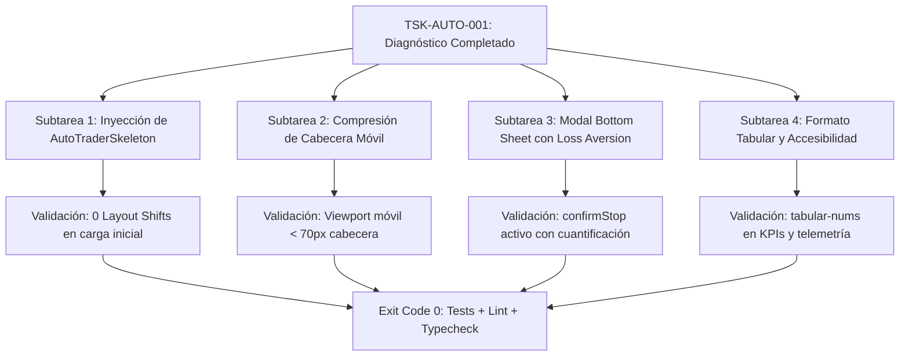

# UI EXECUTION CONTRACT — Anti-Slop Edition (Engineering-OS v4.1 RC)

| Metadata | Valor |
| :--- | :--- |
| **Task ID** | `TSK-AUTO-001` |
| **Epic ID** | `EPC-ANTISLOP` |
| **Versión del Contrato** | `4.0` |
| **Estado** | `PENDING` *(Listo para revisión y aprobación de usuario)* |
| **Fase del Pipeline** | `Fase 1 (Diagnóstico) → Fase 2 (Inyección de Reglas) → Fase 4 (Refactorización)` |
| **Lenguaje / Stack** | `TypeScript` · `React 19` · `Tailwind CSS v4` · `Phosphor / Lucide` |
| **Plataformas Objetivo** | **Desktop Web SaaS** (1280x800) & **Mobile PWA Táctil** (390x844) |
| **Fuente de Auditoría** | `AUDIT_ANTISLOP.json` + Inspección visual en navegador (`localhost:5173`) |

---

## 1. Declaración de Objetivo (Goal)

> Refactor AutoTrader screen to implement loading skeleton states, mobile header hierarchy compression, loss aversion stop dialog, and right-aligned tabular numerals without altering trading bot execution logic or context state contracts.

---

## 2. Especificación Determinista de Contrato JSON (IR v4.0)

```json
{
  "contract_version": "4.0",
  "status": "PENDING",
  "language": "typescript",
  "task_id": "TSK-AUTO-001",
  "epic_id": "EPC-ANTISLOP",
  "goal": "Refactor AutoTrader screen to implement loading skeleton states, mobile header hierarchy compression, loss aversion stop dialog, and right-aligned tabular numerals without altering trading bot execution logic",
  "scope": {
    "target_files": [
      "frontend/src/components/AutoTraderView.tsx",
      "frontend/src/components/autotrader/AutoTraderTelemetryPanel.tsx",
      "frontend/src/components/ui/AutoTraderSkeleton.tsx"
    ],
    "forbidden_files": [
      "frontend/src/contexts/AutoTraderContext.tsx",
      "frontend/src/lib/supabase.ts",
      "frontend/src/App.tsx",
      "supabase/**/*",
      "app.py",
      "*.py"
    ],
    "authorized_global_files": []
  },
  "depends_on": [],
  "contracts": {
    "types_file": "frontend/src/contexts/AutoTraderContext.tsx",
    "function_signatures": [
      "export const AutoTraderView: React.FC<AutoTraderViewProps>",
      "export const AutoTraderTelemetryPanel: React.FC<AutoTraderTelemetryPanelProps>",
      "export const AutoTraderSkeleton: React.FC"
    ]
  },
  "env": {
    "NODE_ENV": "test"
  },
  "execution_steps": [
    "Verify target components against DESIGN.md depth and typography specifications",
    "Implement AutoTraderSkeleton shimmer matching exact desktop and mobile geometry to prevent layout shifts",
    "Compress mobile sticky header badges to prevent screen space consumption in compact viewports",
    "Implement stop session confirmation bottom sheet quantifying protected capital and market exit impact",
    "Apply tabular-nums font feature and alignment to all numeric indicators across telemetry and KPI cards",
    "Verify zero emojis in component markup and maintain existing context state contracts intact"
  ],
  "commands": {
    "test": "node --test frontend/src/__tests__/antislop_autotrader.test.js",
    "lint": "npx oxlint frontend/src/components/AutoTraderView.tsx frontend/src/components/autotrader/AutoTraderTelemetryPanel.tsx",
    "typecheck": "npm run build --prefix frontend"
  },
  "acceptance_criteria": [
    "assert.ok(viewHtml.includes('AutoTraderSkeleton'), 'AutoTraderSkeleton rendered during loading state')",
    "assert.ok(viewHtml.includes('tabular-nums'), 'Numeric data columns use tabular-nums font feature')",
    "assert.ok(viewHtml.includes('confirmStop') || viewHtml.includes('Proteger'), 'Stop session modal includes capital protection copy')",
    "assert.strictEqual(/[\\u{1F300}-\\u{1F9FF}]/u.test(viewHtml), false, 'Zero emojis present in AutoTraderView')"
  ],
  "definition_of_done": [
    "commands.test returns exit code 0",
    "commands.lint returns exit code 0",
    "commands.typecheck returns exit code 0",
    "All financial metrics in AutoTraderView and AutoTraderTelemetryPanel use tabular numerals",
    "Zero emojis detected in AutoTrader markup",
    "git diff --name-only shows only target_files"
  ],
  "rollback": {
    "command": "git checkout HEAD -- frontend/src/components/AutoTraderView.tsx frontend/src/components/autotrader/AutoTraderTelemetryPanel.tsx"
  }
}
```

---

## 3. Matriz de Requisitos Anti-Slop & Bugs Diagnosticados

### 3.1 Vista Móvil (PWA Táctil / Ergonomía del Pulgar)
* **Bug Crítico 1 (Cabecera Flotante Sobredimensionada):**
  * En pantallas móviles (`390x844`), la cabecera fija (`sticky top-0 z-30`) ocupa más de 160px de altura vertical (25-30% del viewport) debido a la acumulación vertical de 4 badges (`CEREBRO CUANTITATIVO`, `RENDER 24/7 CLOUD`, badge de estado), reloj de sesión y botón de activación.
  * *Solución:* Ocultar badges secundarios en móvil (`hidden sm:inline-flex`), reducir padding vertical (`py-2 sm:py-3`), y priorizar el nombre del bot, status dot y el botón de acción principal.
* **Bug Crítico 2 (Estado Fantasma / Acción Destructiva sin Confirmación):**
  * Las variables `confirmStop`, `showPositionSheet` y `showClosedTrades` están declaradas en el estado local de `AutoTraderView.tsx` y registradas en `useModalKeyboard`, pero **nunca se renderizan en el JSX**.
  * Al pulsar "Detener / Salir" (`autoTrader.stopSession()`), se liquida la posición inmediatamente sin advertencia ni confirmación cuantificada.
  * *Solución:* Implementar Bottom Sheet modal de confirmación con psicología UXPeak (*Loss Aversion*), cuantificando los fondos demo a reintegrar y la posición a cerrar.
* **Bug 3 (Teclado Móvil en Entrada de Capital):**
  * El input numérico cuando se selecciona `Otro` no tiene `inputMode="decimal"` ni `aria-label`, forzando el teclado alfanumérico en dispositivos móviles y careciendo de accesibilidad WCAG.

### 3.2 Vista Desktop (Web SaaS / Información Densa)
* **Bug 4 (Carencia de Shimmer / Alto CLS):**
  * Infracción marcada en auditoría: `[LOADING_STATE] frontend/src/components/AutoTraderView.tsx no loading state`.
  * La pantalla no implementa prop `isLoading` ni skeleton UI.
  * *Solución:* Crear [AutoTraderSkeleton.tsx](file:///c:/Users/user/.gemini/antigravity/scratch/crypto-analyzer/frontend/src/components/ui/AutoTraderSkeleton.tsx) con siluetas shimmer exactas de la cabina de mando, los 4 KPI bento y los paneles de telemetría.
* **Bug 5 (Alineación Numérica y Formato Tabular):**
  * Métricas de balance, precios de entrada, PnL no realizado y columnas del libro contable carecen en múltiples celdas de `tabular-nums` y alineación estricta a la derecha.
* **Bug 6 (Inconsistencia en Tarjeta de Salvaguardas):**
  * En la "Cabina de Mando y Asignación de Capital", 3 tarjetas son controles interactivos con botones (`Capital Asignado`, `Ventana de Tiempo`, `Reportes Telegram`), mientras que `Salvaguarda Auto` es solo texto estático de solo lectura. Se debe distinguir visualmente con un tratamiento sutil de "Parámetros del Sistema".

---

## 4. Descomposición de Subtareas Atómicas



### Subtarea 1: Inyección de Estados Mandatorios (Cero CLS)
* **Archivo Nuevo:** `frontend/src/components/ui/AutoTraderSkeleton.tsx`
* Implementar silueta animada con efecto shimmer (`animate-pulse`) que refleje idénticamente:
  1. Header de sesión institucional (54px).
  2. Cabina de mando de 4 tarjetas (140px).
  3. Bento de 4 KPIs (100px).
  4. Radar / Monitor de posición (200px).
  5. Paneles gemelos de telemetría y libro contable (240px).
* Integrar prop opcional `isLoading?: boolean` en `AutoTraderView.tsx`.

### Subtarea 2: Compresión de Cabecera Móvil (Thumb Zone Ergonomics)
* **Archivo:** `frontend/src/components/AutoTraderView.tsx`
* Reducir altura del sticky header en vista móvil de ~160px a <70px.
* Colapsar insignias secundarias en móvil con `hidden sm:inline-flex`.
* Optimizar targets táctiles de los presets (`$50`, `$100`, `$500`, `Otro`) a `min-h-[44px]`.

### Subtarea 3: Modal de Salida Segura con Psicología de Aversión a la Pérdida
* **Archivo:** `frontend/src/components/AutoTraderView.tsx`
* Rescatar el estado `confirmStop` y conectar el botón "Detener / Salir" al Bottom Sheet / Modal.
* Micro-copia:
  * Mostrar exactamente el saldo protegido (ej. `$100.00 USDT`) y el impacto en posiciones activas antes de confirmar la detención.

### Subtarea 4: Formato Tabular y Refinamiento de Telemetría
* **Archivos:** `AutoTraderView.tsx` y `AutoTraderTelemetryPanel.tsx`
* Envolver métricas monetarias en `font-mono tabular-nums`.
* Evitar truncamiento severo del texto de veredicto en la tabla de candidatos de Binance Spot.

---

## 5. Protocolo de Aislamiento y No-Regresión

Para cumplir estrictamente las reglas de **Engineering-OS v4.1 RC**:
1. **Intocabilidad del Motor Algorítmico:** Queda terminantemente prohibido alterar `AutoTraderContext.tsx` o sus cálculos matemáticos (gestión de trailing stops, cálculo de RSI, trailing armed, órdenes WebSocket a Binance).
2. **Límite de Archivos:** Modificación limitada estrictamente a los 2 archivos de implementación autorizados (`AutoTraderView.tsx` y `AutoTraderTelemetryPanel.tsx`) más el componente UI exento (`AutoTraderSkeleton.tsx`).
3. **No tocar archivos de backend ni Supabase:** `app.py`, scripts de Python y `supabase.ts` permanecen intactos.

---

## 6. Comandos de Validación Ejecutables

```bash
# 1. Ejecutar suite de pruebas de no-regresión AutoTrader
node --test frontend/src/__tests__/antislop_autotrader.test.js

# 2. Análisis estático y linter Oxlint
npx oxlint frontend/src/components/AutoTraderView.tsx frontend/src/components/autotrader/AutoTraderTelemetryPanel.tsx

# 3. Verificación de compilación TypeScript y bundle Vite
npm run build --prefix frontend

# 4. Validación del contrato Engineering-OS
node .agents/skills/engineering-os/scripts/validate_contract.js contracts/TSK-AUTO-001.contract.json
```

---

## 7. Plan de Rollback Inmediato

En caso de fallo en cualquiera de las fases:
```bash
git checkout HEAD -- frontend/src/components/AutoTraderView.tsx frontend/src/components/autotrader/AutoTraderTelemetryPanel.tsx
rm -f frontend/src/components/ui/AutoTraderSkeleton.tsx
```
