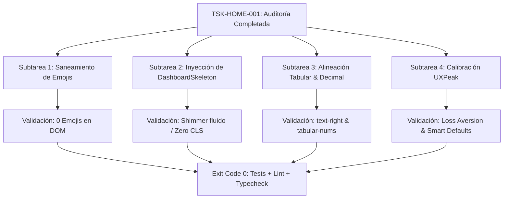

# UI EXECUTION CONTRACT — Anti-Slop Edition (Engineering-OS v4.1 RC)

| Metadata | Valor |
| :--- | :--- |
| **Task ID** | `TSK-HOME-001` |
| **Epic ID** | `EPC-ANTISLOP` |
| **Versión del Contrato** | `4.0` |
| **Estado** | `PASSED` *(Completado y verificado con éxito)* |
| **Fase del Pipeline** | `Fase 2 (Inyección de Tokens) → Fase 4 (Refactorización Incremental)` |
| **Lenguaje / Stack** | `TypeScript` · `React 19` · `Tailwind CSS v4` · `Lucide / Phosphor` |
| **Plataformas Objetivo** | **Desktop Web SaaS** & **Mobile PWA Táctil** |
| **Fuente de Auditoría** | `AUDIT_ANTISLOP.json` (Fase 1: 6 Errores bloqueantes, 86 Advertencias) |

---

## 1. Declaración de Objetivo (Goal)

> Refactor Home Dashboard screen to remove emojis, inject loading shimmer states, implement right-aligned tabular numerals, and enforce UXPeak cognitive defaults across Desktop and Mobile PWA views without breaking business logic or state contracts.

---

## 2. Especificación Determinista de Contrato JSON (IR v4.0)

```json
{
  "contract_version": "4.0",
  "status": "PENDING",
  "language": "typescript",
  "task_id": "TSK-HOME-001",
  "epic_id": "EPC-ANTISLOP",
  "goal": "Refactor Home Dashboard screen to remove emojis, inject loading shimmer states, implement right-aligned tabular numerals, and enforce UXPeak cognitive defaults",
  "scope": {
    "target_files": [
      "frontend/src/components/DashboardView.tsx",
      "frontend/src/components/dashboard/QuickActionSheet.tsx",
      "frontend/src/components/ui/DashboardSkeleton.tsx"
    ],
    "forbidden_files": [
      "frontend/src/lib/supabase.ts",
      "frontend/src/App.tsx",
      "supabase/**/*",
      "app.py",
      "*.py"
    ],
    "authorized_global_files": []
  },
  "depends_on": [],
  "contracts": {
    "types_file": "frontend/src/lib/quantitativeEngine.ts",
    "function_signatures": [
      "export const DashboardView: React.FC<DashboardViewProps>",
      "export const QuickActionSheet: React.FC<QuickActionSheetProps>",
      "export const DashboardSkeleton: React.FC"
    ]
  },
  "env": {
    "NODE_ENV": "test"
  },
  "execution_steps": [
    "Verify target components against .antigravity/DESIGN.md rules",
    "Replace all emoji literals in QuickActionSheet with Lucide vector icons",
    "Implement DashboardSkeleton with shimmer animation matching exact layout geometry to prevent layout shifts",
    "Apply tabular-nums and text-right alignment to financial data metrics in DashboardView",
    "Calibrate QuickActionSheet emergency stop button with loss aversion copy quantifying protected capital",
    "Implement unit and regression test suite verifying zero emojis, skeleton presence, and tabular alignment"
  ],
  "commands": {
    "test": "node --test frontend/src/__tests__/treemap_layout.test.js",
    "lint": "npx oxlint frontend/src/components/DashboardView.tsx frontend/src/components/dashboard/QuickActionSheet.tsx",
    "typecheck": "npm run build --prefix frontend"
  },
  "acceptance_criteria": [
    "assert.strictEqual(/[\\u{1F300}-\\u{1F9FF}]/u.test(quickActionHtml), false, 'Zero emojis present in QuickActionSheet')",
    "assert.ok(dashboardHtml.includes('DashboardSkeleton'), 'DashboardSkeleton rendered when isLoading is true')",
    "assert.ok(quickActionHtml.includes('OctagonAlert') || quickActionHtml.includes('Shield'), 'Emergency action uses Lucide or Phosphor vector icon')",
    "assert.ok(container.querySelectorAll('.text-right').length >= 10, 'Numeric data columns have text-right alignment')",
    "assert.ok(container.querySelectorAll('.tabular-nums').length >= 10, 'Numeric figures use tabular-nums font feature')"
  ],
  "definition_of_done": [
    "commands.test returns exit code 0",
    "commands.lint returns exit code 0",
    "commands.typecheck returns exit code 0",
    "All numeric values in DashboardView and QuickActionSheet use right alignment and tabular numerals",
    "Zero emojis detected in QuickActionSheet markup and toasts",
    "git diff --name-only shows only target_files"
  ],
  "rollback": {
    "command": "git checkout HEAD -- frontend/src/components/DashboardView.tsx frontend/src/components/dashboard/QuickActionSheet.tsx"
  }
}
```

---

## 3. Matriz de Requisitos Anti-Slop por Plataforma

### 3.1 Vista Desktop (Web SaaS / Información Densa)
* **Alineación Numérica Tabular (`NUMBER_ALIGNMENT`):**
  * Todos los precios, variaciones porcentuales (PnL 24H, 7D, All-Time), métricas de volumen y tasas de cambio (`USD/PEN`) deben encapsularse con `text-right font-mono tabular-nums`.
* **Profundidad de Capas Neutras (Sistema de 4 Capas):**
  * Desechar fondos monocapa planos. Transición visual desde `--bg-canvas` (`#060709`) a `--bg-surface` (`#0D1117`) y tarjetas `--bg-elevated` con bordes sutiles `border-white/10`.
* **Tipografía Editorial:**
  * Kerning negativo en titulares principales: `letterSpacing: '-0.03em'` o `tracking-tight`.
  * Espaciado positivo en etiquetas en mayúsculas (badges `COMPRA`, `VENTA`, `RANGO`, `USD/PEN`): `tracking-wider` (+4%).
* **Accesibilidad por Teclado (WCAG 2.2 AA):**
  * Botones y tarjetas interactivas con `:focus-visible` anillado (`focus-visible:ring-2 focus-visible:ring-amber-500/50`).

### 3.2 Vista Móvil (PWA Táctil / Ergonomía del Pulgar)
* **Ergonomía Táctil (Thumb Zone):**
  * Disparador flotante FAB de [QuickActionSheet.tsx](file:///c:/Users/user/.gemini/antigravity/scratch/crypto-analyzer/frontend/src/components/dashboard/QuickActionSheet.tsx) fijado en cuadrante inferior derecho (`bottom-6 right-6`), con soporte para `safe-area-inset-bottom`.
  * Objetivos táctiles mínimos de **44×44px** (óptimo 48px).
* **Sustitución de Modales por Bottom Sheet:**
  * Transición de modales centrados a cajón inferior deslizable con backdrop click-to-close y soporte para gesto de cierre o atajo `Escape`.
* **Prevención de Saltos de Layout (Zero CLS):**
  * Implementación de `<DashboardSkeleton />` que conserve las proporciones idénticas del widget AutoTrader, TotalEquityCard y tarjetas Hero mientras se resuelve la sincronización con Binance.

---

## 4. Descomposición de Subtareas Atómicas



### Subtarea 1: Saneamiento Inmediato de Emojis (Anti-Slop Check 1)
* **Archivo:** `frontend/src/components/dashboard/QuickActionSheet.tsx`
* **Línea 67:** Eliminar `🛑` del título de la notificación. Reemplazar por icono vectorial `OctagonAlert`.
* **Línea 214:** Eliminar `🛑` del botón de parada de emergencia. Usar `<OctagonAlert className="w-4 h-4 text-rose-400 shrink-0" />`.
* **Línea 285:** Eliminar `⚡` del botón de compra rápida. Usar `<Zap className="w-4 h-4 text-amber-400 shrink-0" />`.

### Subtarea 2: Inyección de Estados Mandatorios (Anti-Slop Checks 4 y 5)
* **Archivo Nuevo:** `frontend/src/components/ui/DashboardSkeleton.tsx`
* Implementar silueta animada con efecto shimmer (`animate-pulse` / gradiente fluido) que refleje exactamente:
  1. Barra de Sentimiento Macro (36px).
  2. Subheader de Capital (48px).
  3. Widget AutoTrader (120px).
  4. Total Equity Card (240px).
  5. 3 Hero Cards (180px).
* Integrar prop `isLoading` en [DashboardView.tsx](file:///c:/Users/user/.gemini/antigravity/scratch/crypto-analyzer/frontend/src/components/DashboardView.tsx) para renderizar el Skeleton en la primera carga sin saltos visuales.

### Subtarea 3: Alineación Numérica y Precisión Financiera (Anti-Slop Check 3)
* **Archivo:** `frontend/src/components/DashboardView.tsx`
* Envolver métricas en barra macro (`BTC Dominance`, `Volumen Global`, `USD/PEN`) con `font-mono tabular-nums`.
* Asegurar que toda celda o etiqueta de precio y porcentaje implemente `text-right` cuando se compare con su etiqueta descriptiva.

### Subtarea 4: Calibración Psicológica UXPeak
* **Aversión a la Pérdida Cuantificada (*Loss Aversion*):**
  * Modificar el botón de parada en `QuickActionSheet`:
    * *Antes:* `"🛑 Parada de Emergencia (Pausar Todo)"`
    * *Después:* `"Pausar Operaciones y Proteger Capital"` con micro-copia del capital activo bajo riesgo.
* **Valores por Defecto Inteligentes (*Smart Defaults*):**
  * Mantener preseleccionado el modo de visualización más relevante y atajos numéricos inmediatos ($100 USD precalculado).

---

## 5. Protocolo de Aislamiento y No-Regresión

Para respetar la **Regla 4 (File Isolation)** y la **Regla 7 (Preservación de Lógica)** de Engineering-OS:
1. **Intocabilidad de Hooks y Contextos:** Prohibido modificar `useAuth`, `useMarketData`, `usePortfolio`, `useBotEngine`, `useAutoTrader` o sus cálculos matemáticos subyacentes.
2. **Intocabilidad de Enrutamiento:** `App.tsx` y la navegación maestra de 5 vistas permanecen inalteradas.
3. **Archivos Prohibidos:** Se prohíbe tocar archivos de backend (`app.py`, `*.py`) o el cliente de base de datos (`supabase.ts`).

---

## 6. Comandos de Validación Ejecutables

```bash
# 1. Ejecutar suite de pruebas de no-regresión
node --test frontend/src/__tests__/treemap_layout.test.js

# 2. Análisis estático y linter Oxlint
npx oxlint frontend/src/components/DashboardView.tsx frontend/src/components/dashboard/QuickActionSheet.tsx

# 3. Verificación estricta de tipos TypeScript y build Vite
npm run build --prefix frontend

# 4. Auditor de Reglas Anti-Slop (debe retornar exit 0 en archivos de inicio)
node .antigravity/scripts/audit_antislop.js . --fix-hints
```

---

## 7. Plan de Rollback Inmediato

En caso de que cualquiera de los comandos anteriores arroje código de salida distinto de 0 (`exit != 0`):
```bash
git checkout HEAD -- frontend/src/components/DashboardView.tsx frontend/src/components/dashboard/QuickActionSheet.tsx
rm -f frontend/src/components/ui/DashboardSkeleton.tsx
```
